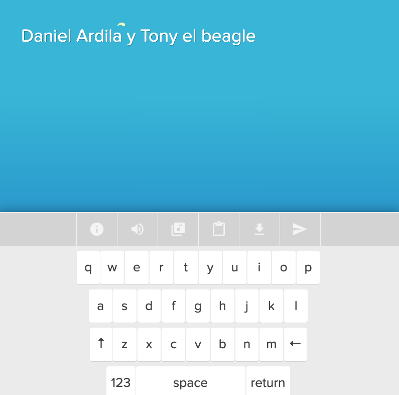

#### Exploración de referentes

**1. Proyecto "Patatap" y "Typatone" por Jono Brandel y Lullatone** 

[Link al proyecto Patatap](https://patatap.com/)

[Link al proyecto Typatone](https://typatone.com/)

**Breve descripción:** Una aplicación web que convierte las pulsaciones del teclado en sonidos y animaciones visuales, ofreciendo una experiencia sinestésica donde cada tecla genera una combinación única de audio y gráficos generativos.

**Aspectos a revisar:** Me llama mucho la atención del proyecto que por cada interacción que se realiza con las teclas, los visuales aunque sean los mismos inician de manera aleatoria es un diseño generativo pero el arte generativo lo construye el usuario al interactuar y generar melodias.

**2. Proyecto "Unnumbered Sparks" por Aaron Koblin y Janet Echelman**

[Link al proyecto Unnumbered Sparks](https://www.aaronkoblin.com/project/unnumbered-sparks/)

**Breve descripción:** Una instalación interactiva a gran escala que consiste en una escultura aérea iluminada, donde los usuarios con sus celulares pueden dibujar patrones de luz en tiempo real sobre la superficie de la escultura.

**Aspectos a revisar:** Me llama mucho la atención que se integren los celulares para que los usarios puedan interactuar con la obra y que los patrones que dibujan sobre la escultura son generativos y proyectados en tiempo real seguún la interacción, dandole vida a la obra.

**3. Proyecto Emotia - EXpy Fest 2024**

[Link al Proyecto Emotia](https://expy.com.py/expy-fest/emotia-de-camila-rodriguez-uy/)

**Breve descripción:** Es un performance artistico con arte generativo y neurociencia, mediante interfaz cerebro-computadora (EGG headset) para escanear sus ondas cerebrales en tiempo real para ser procesadas por IA y traducidas en una obra de arte generativo.

**Aspectos a revisar:** Utiliza datos en tiempo real para generar arte generativo en tiempo real, usando un dispositivo biomedico como receptor de datos para luego ser interpretados por la IA y generar visuales en tiempo real a partir de las ondas cerebrales.
