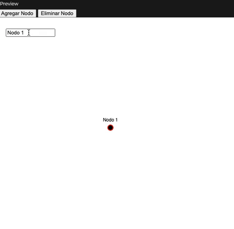

#### Ejemplo 1 "P_2_3_3_01":


[Link de Generative Design](http://www.generative-gestaltung.de/2/sketches/?01_P/P_2_3_3_01)

**Descripción:** Este sketch permite dibujar con texto, generando una secuencia de letras que siguen el movimiento del mouse. El tamaño de las letras varía según la distancia recorrida, y la rotación se ajusta en función del ángulo de movimiento.

<details>
  <summary>Código fuente</summary>
  
  ```js
  // P_2_3_3_01
//
// Generative Gestaltung – Creative Coding im Web
// ISBN: 978-3-87439-902-9, First Edition, Hermann Schmidt, Mainz, 2018
// Benedikt Groß, Hartmut Bohnacker, Julia Laub, Claudius Lazzeroni
// with contributions by Joey Lee and Niels Poldervaart
// Copyright 2018
//
// http://www.generative-gestaltung.de
//
// Licensed under the Apache License, Version 2.0 (the "License");
// you may not use this file except in compliance with the License.
// You may obtain a copy of the License at http://www.apache.org/licenses/LICENSE-2.0
// Unless required by applicable law or agreed to in writing, software
// distributed under the License is distributed on an "AS IS" BASIS,
// WITHOUT WARRANTIES OR CONDITIONS OF ANY KIND, either express or implied.
// See the License for the specific language governing permissions and
// limitations under the License.

/**
 * draw tool. shows how to draw with dynamic elements.
 *
 * MOUSE
 * drag                : draw with text
 *
 * KEYS
 * del, backspace      : clear screen
 * arrow up            : angle distortion +
 * arrow down          : angle distortion -
 * s                   : save png
 */
'use strict';

var x = 0;
var y = 0;
var stepSize = -5.0;

var font = 'Georgia';
var letters = 'All the world\'s a stage, and all the men and women merely players. They have their exits and their entrances.';
var fontSizeMin = 3;
var angleDistortion = 0.0;

var counter = 0;

function setup() {
  // use full screen size
  createCanvas(displayWidth, displayHeight);
  background(255);
  cursor(CROSS);

  x = mouseX;
  y = mouseY;

  textFont(font);
  textAlign(LEFT);
  fill(0);
}

function draw() {
  if (mouseIsPressed && mouseButton == LEFT) {
    var d = dist(x, y, mouseX, mouseY);
    textSize(fontSizeMin + d / 2);
    var newLetter = letters.charAt(counter);
    stepSize = textWidth(newLetter);

    if (d > stepSize) {
      var angle = atan2(mouseY - y, mouseX - x);

      push();
      translate(x, y);
      rotate(angle + random(angleDistortion));
      text(newLetter, 0, 0);
      pop();

      counter++;
      if (counter >= letters.length) counter = 0;

      x = x + cos(angle) * stepSize;
      y = y + sin(angle) * stepSize;
    }
  }
}

function mousePressed() {
  x = mouseX;
  y = mouseY;
}

function keyReleased() {
  if (key == 's' || key == 'S') saveCanvas(gd.timestamp(), 'png');
  if (keyCode == DELETE || keyCode == BACKSPACE) background(255);
}

function keyPressed() {
  // angleDistortion ctrls arrowkeys up/down
  if (keyCode == UP_ARROW) angleDistortion += 0.1;
  if (keyCode == DOWN_ARROW) angleDistortion -= 0.1;
}

  ```
  
</details>


**Parámetros:**

- **`stepSize`:** Define la distancia entre caracteres según el movimiento del mouse.
- **`fontSizeMin`:** Establece el tamaño mínimo de la fuente.
- **`angleDistortion`:** Controla la distorsión del ángulo al dibujar los caracteres.
- **`letters`:** Contiene la secuencia de texto utilizada en el dibujo.


**Variaciones:**
1. Variante:
   Modifiqué la función `Draw()` especificamente la linea `textSize(fontSizeMin + d / 2);` por `textSize(fontSizeMin + d / 8);` haciendo que el tamaño del texto aumente más lentamente en función de la distancia recorrida por el mouse. Esto genera un efecto visual donde las letras aparecen con un retraso o delay, ya que el crecimiento del texto es menos agresivo. Esto crea un efecto de caligrafia con pincel dinámico con trazos más suavizados.

   <details>
     <summary>Código</summary>
     
     ```js
    // P_2_3_3_01
    //
    // Generative Gestaltung – Creative Coding im Web
    // ISBN: 978-3-87439-902-9, First Edition, Hermann Schmidt, Mainz, 2018
    // Benedikt Groß, Hartmut Bohnacker, Julia Laub, Claudius Lazzeroni
    // with contributions by Joey Lee and Niels Poldervaart
    // Copyright 2018
    //
    // http://www.generative-gestaltung.de
    //
    // Licensed under the Apache License, Version 2.0 (the "License");
    // you may not use this file except in compliance with the License.
    // You may obtain a copy of the License at http://www.apache.org/licenses/LICENSE-2.0
    // Unless required by applicable law or agreed to in writing, software
    // distributed under the License is distributed on an "AS IS" BASIS,
    // WITHOUT WARRANTIES OR CONDITIONS OF ANY KIND, either express or implied.
    // See the License for the specific language governing permissions and
    // limitations under the License.
    
    /**
     * draw tool. shows how to draw with dynamic elements.
     *
     * MOUSE
     * drag                : draw with text
     *
     * KEYS
     * del, backspace      : clear screen
     * arrow up            : angle distortion +
     * arrow down          : angle distortion -
     * s                   : save png
     */
    'use strict';
    
    var x = 0;
    var y = 0;
    var stepSize = -5.0;
    
    var font = 'Georgia';
    var letters = 'All the world\'s a stage, and all the men and women merely players. They have their exits and their entrances.';
    var fontSizeMin = 3;
    var angleDistortion = 0.0;
    
    var counter = 0;
    
    function setup() {
      // use full screen size
      createCanvas(displayWidth, displayHeight);
      background(255);
      cursor(CROSS);
    
      x = mouseX;
      y = mouseY;
    
      textFont(font);
      textAlign(LEFT);
      fill(0);
    }
    
    function draw() {
      if (mouseIsPressed && mouseButton == LEFT) {
        var d = dist(x, y, mouseX, mouseY);
        textSize(fontSizeMin + d / 8); // Modificación realizada.
        var newLetter = letters.charAt(counter);
        stepSize = textWidth(newLetter);
    
        if (d > stepSize) {
          var angle = atan2(mouseY - y, mouseX - x);
    
          push();
          translate(x, y);
          rotate(angle + random(angleDistortion));
          text(newLetter, 0, 0);
          pop();
    
          counter++;
          if (counter >= letters.length) counter = 0;
    
          x = x + cos(angle) * stepSize;
          y = y + sin(angle) * stepSize;
        }
      }
    }
    
    function mousePressed() {
      x = mouseX;
      y = mouseY;
    }
    
    function keyReleased() {
      if (key == 's' || key == 'S') saveCanvas(gd.timestamp(), 'png');
      if (keyCode == DELETE || keyCode == BACKSPACE) background(255);
    }
    
    function keyPressed() {
      // angleDistortion ctrls arrowkeys up/down
      if (keyCode == UP_ARROW) angleDistortion += 0.1;
      if (keyCode == DOWN_ARROW) angleDistortion -= 0.1;
    }

     ```
     
   </details>
   
     


   
2. Variante:
   Modifiqué el codigo para que cada vez que se dibuje una letra cambie de color aleatoriamente, sin embargo me parece que seria mejor si cambia de color cada vez que hay una palabra nueva es decir cada vez que se presenta un espacio. Para cambiar el color cada vez para una sola letra que se dibuje simplemente se agrega esta linea de codigo en la funcion `Draw()` dentro del bloque de codigo antes de generar el texto así:
   ```js
   function Draw(){
   
   // ... resto del codigo
   
    push();
    translate(x, y);
    rotate(angle + random(angleDistortion));
     // Asigna un color aleatorio a cada letra
    fill(random(255), random(255), random(255));  
    text(newLetter, 0, 0);
    pop();  
  
   // ... resto del codigo
   
   }
   ```
 
    
  

   Sin embargo como me pareció que seria mas chevere si cambiara de color cada palabra y no cada letra entonces la idea la variante es que cambie de color cada vez que se presente un espacio. Primero hay que agregar un una nueva variable global que almacene el color actual de la palabra (`var currentColor;`), luego en la funcion `setup()` debemos asignar un color inicial `currentColor = color(random(255),random(255),random(255));`, antes de dibujar el texto colorear la palabra con el mismo color actual `fill(currentColor);` y dentro de la condición `if (d > stepsize){}` que esta dentro de la funcion `draw()`agregar la condicion que si la letra es un espacio entonces asignar un color aleatorio con `if (newLetter === ' ') {currentColor = color(random(255), random(255), random(255));}`.

   <details>
     <summary>Código</summary>
     
     ```js
     'use strict';
    
    var x = 0;
    var y = 0;
    var stepSize = 5.0;
    
    var font = 'Georgia';
    var letters = 'All the world\'s a stage, and all the men and women merely players.';
    var fontSizeMin = 3;
    var angleDistortion = 0.0;
    var counter = 0;
    
    // Variable para almacenar el color actual de la palabra
    var currentColor;
    
    function setup() {
      createCanvas(windowWidth, windowHeight);
      background(255);
      cursor(CROSS);
    
      textFont(font);
      textAlign(LEFT);
      fill(0);
    
      // Asignar un color inicial
      currentColor = color(random(255), random(255), random(255));
    }
    
    function draw() {
      if (mouseIsPressed && mouseButton == LEFT) {
        var d = dist(x, y, mouseX, mouseY);
        textSize(fontSizeMin + d / 16); // Mantiene el efecto de delay en el pincel
    
        var newLetter = letters.charAt(counter);
        stepSize = textWidth(newLetter);
    
        if (d > stepSize) {
          var angle = atan2(mouseY - y, mouseX - x);
    
          push();
          translate(x, y);
          rotate(angle + random(angleDistortion));
    
          // Asignar el mismo color a toda la palabra actual
          fill(currentColor);
          text(newLetter, 0, 0);
          
          pop();
    
          // Si la letra es un espacio, asignar un nuevo color aleatorio
          if (newLetter === ' ') {
            currentColor = color(random(255), random(255), random(255));
          }
    
          // Actualizar la posición para continuar el trazo en la dirección correcta
          x = x + cos(angle) * stepSize;
          y = y + sin(angle) * stepSize;
    
          counter++;
          if (counter >= letters.length) counter = 0;
        }
      }
    }
    
    function mousePressed() {
      // Asegurar que el trazo empieza en el punto donde el usuario hace clic
      x = mouseX;
      y = mouseY;
    }

     ```
     
   </details>


   

**Aplicación potencial en conexto de entretenimiento digital:**

**Decodificación de frases a partir de palabras**
Los usuarios dibujan en la pantalla y aparecen palabras en negro hasta que encuentran palabras clave en color, que forman parte de una frase oculta. Luego, se van organizando automaicamente esas palabras en una cuadrícula para reconstruir el mensaje.

💡 **Aplicaciones Potenciales**

1️⃣ Educación y Aprendizaje de Idiomas 📝
- Ayuda a estudiantes a descubrir frases en otro idioma de forma interactiva.
- Refuerza la gramática y el vocabulario mediante el juego.
- Ejemplo:
    - 📝 Un estudiante de inglés dibuja palabras en la pantalla y encuentra “the”, “cat”, “is”, “on”, “the”, “table”. Ahora debe arrastrarlas y ordenarlas para formar una frase coherente.

2️⃣ Escape Rooms y Juegos de Misterio 🔍
- Los jugadores encuentran pistas ocultas en un texto y deben organizarlas para resolver acertijos.
- Se pueden integrar palabras engañosas para aumentar la dificultad.

3️⃣ Aprendizaje Histórico o Narrativo 📜
- Se revelan frases importantes de textos históricos o filosóficos de forma interactiva.
- Permite reconstruir discursos o documentos clave.

4️⃣ Aventura y Ciencia Ficción 🚀
- Se usa en juegos donde los jugadores descifran mensajes secretos o códigos alienígenas.
- Agrega una capa de exploración y lógica en historias interactivas.

#### Ejemplo 2 "M_6_1_03":


[Link de Generative Design](http://www.generative-gestaltung.de/2/sketches/?02_M/M_6_1_03)

**Descripción:** Este sketch simula una red de nodos conectados por resortes, donde los nodos se repelen entre sí y los resortes intentan mantener una longitud específica. 

<details>
  <summary>Código fuente</summary>
  
  ```js
  // M_6_1_03
  //
  // Generative Gestaltung – Creative Coding im Web
  // ISBN: 978-3-87439-902-9, First Edition, Hermann Schmidt, Mainz, 2018
  // Benedikt Groß, Hartmut Bohnacker, Julia Laub, Claudius Lazzeroni
  // with contributions by Joey Lee and Niels Poldervaart
  // Copyright 2018
  //
  // http://www.generative-gestaltung.de
  //
  // Licensed under the Apache License, Version 2.0 (the "License");
  // you may not use this file except in compliance with the License.
  // You may obtain a copy of the License at http://www.apache.org/licenses/LICENSE-2.0
  // Unless required by applicable law or agreed to in writing, software
  // distributed under the License is distributed on an "AS IS" BASIS,
  // WITHOUT WARRANTIES OR CONDITIONS OF ANY KIND, either express or implied.
  // See the License for the specific language governing permissions and
  // limitations under the License.
  
  /**
   * more nodes and more springs
   *
   * KEYS
   * r             : reset positions
   * s             : save png
   * p             : save pdf
   */
  
  'use strict';
  
  var sketch = function(p) {
    // an array for the nodes
    var nodeCount = 100;
    var nodes = [];
    // an array for the springs
    var springs = [];
  
    // dragged node
    var selectedNode = null;
  
    var nodeDiameter = 16;
  
    p.setup = function() {
      p.createCanvas(p.windowWidth, p.windowHeight);
      p.background(255);
      p.noStroke();
  
      initNodesAndSprings();
    };
  
    p.draw = function() {
  
      p.background(255);
  
      // let all nodes repel each other
      for (var i = 0; i < nodes.length; i++) {
        nodes[i].attractNodes(nodes);
      }
      // apply spring forces
      for (var i = 0; i < springs.length; i++) {
        springs[i].update();
      }
      // apply velocity vector and update position
      for (var i = 0; i < nodes.length; i++) {
        nodes[i].update();
      }
  
      if (selectedNode != null) {
        selectedNode.x = p.mouseX;
        selectedNode.y = p.mouseY;
      }
  
      // draw nodes
      p.stroke(0, 130, 164);
      p.strokeWeight(2);
      for (var i = 0; i < springs.length; i++) {
        p.line(springs[i].fromNode.x, springs[i].fromNode.y, springs[i].toNode.x, springs[i].toNode.y);
      }
      // draw nodes
      p.noStroke();
      for (var i = 0; i < nodes.length; i++) {
        p.fill(255);
        p.ellipse(nodes[i].x, nodes[i].y, nodeDiameter, nodeDiameter);
        p.fill(0);
        p.ellipse(nodes[i].x, nodes[i].y, nodeDiameter - 4, nodeDiameter - 4);
      }
  
    };
  
    var initNodesAndSprings = function() {
      // init nodes
      nodes = [];
  
      var rad = nodeDiameter / 2;
      for (var i = 0; i < nodeCount; i++) {
        var newNode = new Node(p.width / 2 + p.random(-200, 200), p.height / 2 + p.random(-200, 200));
        newNode.minX = rad;
        newNode.minY = rad;
        newNode.maxX = p.width - rad;
        newNode.maxY = p.height - rad;
        newNode.radius = 100;
        newNode.strength = -5;
        nodes.push(newNode);
      }
  
      // set springs randomly
      springs = [];
  
      for (var j = 0; j < nodes.length - 1; j++) {
        var rCount = p.floor(p.random(1, 2));
        for (var i = 0; i < rCount; i++) {
          var r = p.floor(p.random(j + 1, nodes.length));
          var newSpring = new Spring(nodes[j], nodes[r]);
          newSpring.length = 20;
          newSpring.stiffness = 1;
          springs.push(newSpring);
        }
      }
  
    };
  
    p.mousePressed = function() {
      // Ignore anything greater than this distance
      var maxDist = 20;
      for (var i = 0; i < nodes.length; i++) {
        var checkNode = nodes[i];
        var d = p.dist(p.mouseX, p.mouseY, checkNode.x, checkNode.y);
        if (d < maxDist) {
          selectedNode = checkNode;
          maxDist = d;
        }
      }
    };
  
    p.mouseReleased = function() {
      if (selectedNode != null) {
        selectedNode = null;
      }
    };
  
    p.keyPressed = function() {
      if (p.key == 's' || p.key == 'S') p.saveCanvas(gd.timestamp(), 'png');
  
      if (key == 'r' || key == 'R') {
        p.background(255);
        initNodesAndSprings();
      }
    };
  
  };
  
  var myp5 = new p5(sketch);

  ```
  
</details>

**Parámetros:** Los parámetros principales incluyen:

- `nodeCount`: Número de nodos en la simulación.
- `nodeDiameter`: Diámetro visual de los nodos.
- `spring.length`: Longitud natural de los resortes.
- `spring.stiffness`: Rigidez de los resortes.

**Variaciones:**


1. Variante:

    - Se creó un array `nodeNames[]` para almacenar un nombre único para cada nodo.
    - Cada nodo tiene un nombre asignado en `setup()`, con valores como `"Nodo 1", "Nodo 2"`, etc.
    - El texto se dibuja sobre cada nodo en `draw()`, usando `text(nodeNames[i], nodes[i].x, nodes[i].y - 20);`
    - El texto sigue el nodo, pero no es arrastrable por separado, ya que solo los nodos son interactivos.
  
   **¿Qué se logra con esta modificación?**
   
      - Cada nodo tiene un nombre visible.
      - Los nombres siguen a los nodos cuando se mueven.
      - Solo los nodos pueden ser arrastrados, no el texto.
      - Se mantiene la estética del diagrama con resortes.
  
   

   <details>
     <summary>Código</summary>
     
     ```js
     'use strict';
      
      var sketch = function(p) {
        var nodeCount = 100;
        var nodes = [];
        var springs = [];
        var selectedNode = null;
        var nodeDiameter = 16;
      
        // Lista de nombres para los nodos
        var nodeNames = [];
        
        p.setup = function() {
          p.createCanvas(p.windowWidth, p.windowHeight);
          p.background(255);
          p.noStroke();
          
          // Generar nombres aleatorios para los nodos
          for (var i = 0; i < nodeCount; i++) {
            nodeNames.push("Nodo " + (i + 1));
          }
      
          initNodesAndSprings();
        };
      
        p.draw = function() {
          p.background(255);
      
          for (var i = 0; i < nodes.length; i++) {
            nodes[i].attractNodes(nodes);
          }
          for (var i = 0; i < springs.length; i++) {
            springs[i].update();
          }
          for (var i = 0; i < nodes.length; i++) {
            nodes[i].update();
          }
      
          if (selectedNode != null) {
            selectedNode.x = p.mouseX;
            selectedNode.y = p.mouseY;
          }
      
          // Dibujar líneas de conexión (resortes)
          p.stroke(0, 130, 164);
          p.strokeWeight(2);
          for (var i = 0; i < springs.length; i++) {
            p.line(springs[i].fromNode.x, springs[i].fromNode.y, springs[i].toNode.x, springs[i].toNode.y);
          }
      
          // Dibujar nodos con nombres
          p.noStroke();
          for (var i = 0; i < nodes.length; i++) {
            p.fill(255);
            p.ellipse(nodes[i].x, nodes[i].y, nodeDiameter, nodeDiameter);
            p.fill(0);
            p.ellipse(nodes[i].x, nodes[i].y, nodeDiameter - 4, nodeDiameter - 4);
      
            // Mostrar nombre del nodo (siguiendo la posición del nodo)
            p.fill(0);
            p.textAlign(p.CENTER, p.CENTER);
            p.textSize(12);
            p.text(nodeNames[i], nodes[i].x, nodes[i].y - 20); // Posición del texto sobre el nodo
          }
        };
      
        var initNodesAndSprings = function() {
          nodes = [];
          var rad = nodeDiameter / 2;
          for (var i = 0; i < nodeCount; i++) {
            var newNode = new Node(p.width / 2 + p.random(-200, 200), p.height / 2 + p.random(-200, 200));
            newNode.minX = rad;
            newNode.minY = rad;
            newNode.maxX = p.width - rad;
            newNode.maxY = p.height - rad;
            newNode.radius = 100;
            newNode.strength = -5;
            nodes.push(newNode);
          }
      
          springs = [];
          for (var j = 0; j < nodes.length - 1; j++) {
            var rCount = p.floor(p.random(1, 2));
            for (var i = 0; i < rCount; i++) {
              var r = p.floor(p.random(j + 1, nodes.length));
              var newSpring = new Spring(nodes[j], nodes[r]);
              newSpring.length = 20;
              newSpring.stiffness = 1;
              springs.push(newSpring);
            }
          }
        };
      
        p.mousePressed = function() {
          var maxDist = 20;
          for (var i = 0; i < nodes.length; i++) {
            var checkNode = nodes[i];
            var d = p.dist(p.mouseX, p.mouseY, checkNode.x, checkNode.y);
            if (d < maxDist) {
              selectedNode = checkNode;
              maxDist = d;
            }
          }
        };
      
        p.mouseReleased = function() {
          selectedNode = null;
        };
      
        p.keyPressed = function() {
          if (p.key == 's' || p.key == 'S') p.saveCanvas('network', 'png');
      
          if (p.key == 'r' || p.key == 'R') {
            p.background(255);
            initNodesAndSprings();
          }
        };
      };
      
      var myp5 = new p5(sketch);

     ```
     
   </details>
   
     

   
3. Variante:

    - se crearon 2 botones(agregar y eliminar) y un campo para escribirle nombre a cada nodo
    - ahora se pueden crear nodos seleccionando un nodo para editar el nombre, agregar nodo o eliminar el nodo
    - El nodo seleccionado ahora cambia de color para mejorar su identificación

   <details>
     <summary>Codigo html</summary>

     ```html
     <!DOCTYPE html>
      <html>
        <head>
          <script src="https://cdnjs.cloudflare.com/ajax/libs/p5.js/0.7.2/p5.min.js"></script>
          <script src="https://cdnjs.cloudflare.com/ajax/libs/p5.js/0.7.2/addons/p5.dom.min.js"></script>
          <script src="https://cdnjs.cloudflare.com/ajax/libs/p5.js/0.7.2/addons/p5.sound.min.js"></script>
      
          <!-- Generative Design Dependencies -->
          <script src="https://cdn.jsdelivr.net/gh/generative-design/Code-Package-p5.js@master/libraries/gg-dep-bundle/gg-dep-bundle.js"></script>
          <script src="https://cdnjs.cloudflare.com/ajax/libs/opentype.js/0.7.3/opentype.min.js"></script>
          <script src="https://cdnjs.cloudflare.com/ajax/libs/rita/1.3.11/rita-small.min.js"></script>
          <script src="https://cdnjs.cloudflare.com/ajax/libs/chroma-js/1.3.6/chroma.min.js"></script>
          <script src="https://code.jquery.com/jquery-3.3.1.min.js"
            integrity="sha256-FgpCb/KJQlLNfOu91ta32o/NMZxltwRo8QtmkMRdAu8="
            crossorigin="anonymous"></script>
      
          <script src='Node.js'></script>
          <script src='Spring.js'></script>
      
          <link rel="stylesheet" type="text/css" href="style.css">
        </head>
        <body>
      
          <!-- Botón para agregar y eliminar nodos -->
          <button id="addNodeButton">Agregar Nodo</button>
          <button id="deleteNodeButton">Eliminar Nodo</button>
      
      
          <!-- Script principal -->
          <script src="sketch.js"></script>
      
        </body>
      </html>

     ```

     
   </details>

   <details>
     <summary>Código sketch.js</summary>
     
     ```js
     'use strict';
    
      var sketch = function(p) {
      var nodes = [];
      var springs = [];
      var selectedNode = null; // Nodo activo
      var draggingNode = null; // Nodo que está siendo arrastrado
      var nodeDiameter = 16;
      var nodeNames = [];
      var nodeCounter = 1; // Contador de nodos creados
      var inputBox; // Campo de texto para editar nombres
    
      p.setup = function() {
        p.createCanvas(p.windowWidth, p.windowHeight);
        p.background(255);
        p.noStroke();
        
        // Crear el primer nodo en el centro
        createNode(p.width / 2, p.height / 2, "Nodo " + nodeCounter);
    
        // Crear campo de texto para edición de nombres (junto a los botones)
        inputBox = p.createInput('');
        inputBox.position(20, 50); // Colocar cerca de los botones
        inputBox.size(120);
        inputBox.attribute("placeholder", "Nombre del nodo");
    
        // Evento para actualizar el nombre del nodo cuando se edite el texto
        inputBox.input(() => {
          if (selectedNode) {
            let index = nodes.indexOf(selectedNode);
            if (index !== -1) {
              nodeNames[index] = inputBox.value();
            }
          }
        });
      };
    
      p.draw = function() {
        p.background(255);
    
        for (var i = 0; i < nodes.length; i++) {
          nodes[i].attractNodes(nodes);
        }
        for (var i = 0; i < springs.length; i++) {
          springs[i].update();
        }
        for (var i = 0; i < nodes.length; i++) {
          nodes[i].update();
        }
    
        // Si se está arrastrando un nodo, actualizar su posición con el mouse
        if (draggingNode) {
          draggingNode.x = p.mouseX;
          draggingNode.y = p.mouseY;
        }
    
        // Dibujar resortes
        p.stroke(0, 130, 164);
        p.strokeWeight(2);
        for (var i = 0; i < springs.length; i++) {
          p.line(springs[i].fromNode.x, springs[i].fromNode.y, springs[i].toNode.x, springs[i].toNode.y);
        }
    
        // Dibujar nodos con nombres
        p.noStroke();
        for (var i = 0; i < nodes.length; i++) {
          if (nodes[i] === selectedNode) {
            p.fill(255, 0, 0); // Nodo activo en rojo
          } else {
            p.fill(255);
          }
          p.ellipse(nodes[i].x, nodes[i].y, nodeDiameter, nodeDiameter);
          p.fill(0);
          p.ellipse(nodes[i].x, nodes[i].y, nodeDiameter - 4, nodeDiameter - 4);
    
          // Mostrar nombre del nodo
          p.fill(0);
          p.textAlign(p.CENTER, p.CENTER);
          p.textSize(12);
          p.text(nodeNames[i], nodes[i].x, nodes[i].y - 20);
        }
      };
    
      // Función para crear un nuevo nodo
      function createNode(x, y, name) {
        var newNode = new Node(x, y);
        newNode.minX = nodeDiameter / 2;
        newNode.minY = nodeDiameter / 2;
        newNode.maxX = p.width - nodeDiameter / 2;
        newNode.maxY = p.height - nodeDiameter / 2;
        newNode.radius = 100;
        newNode.strength = -5;
        nodes.push(newNode);
        nodeNames.push(name);
      }
    
      // Evento para seleccionar un nodo y permitir arrastrarlo
      p.mousePressed = function() {
        var maxDist = 20;
        for (var i = 0; i < nodes.length; i++) {
          var checkNode = nodes[i];
          var d = p.dist(p.mouseX, p.mouseY, checkNode.x, checkNode.y);
          if (d < maxDist) {
            selectedNode = checkNode; // Seleccionamos el nodo
            draggingNode = checkNode; // Habilitamos el arrastre
    
            // Mostrar el nombre en el campo de texto
            let index = nodes.indexOf(selectedNode);
            if (index !== -1) {
              inputBox.value(nodeNames[index]);
            }
            return;
          }
        }
      };
    
      // Evento para soltar el nodo cuando se deja de hacer clic
      p.mouseReleased = function() {
        draggingNode = null;
      };
    
      // Evento para agregar un nuevo nodo cuando se presiona un botón
      document.getElementById("addNodeButton").addEventListener("click", function() {
        if (selectedNode) {
          nodeCounter++;
          var newX = selectedNode.x + p.random(-50, 50);
          var newY = selectedNode.y + p.random(-50, 50);
          createNode(newX, newY, "Nodo " + nodeCounter);
    
          // Crear un resorte entre el nodo seleccionado y el nuevo nodo
          var newSpring = new Spring(selectedNode, nodes[nodes.length - 1]);
          newSpring.length = 50;
          newSpring.stiffness = 1;
          springs.push(newSpring);
        }
      });
    
      // Evento para eliminar un nodo seleccionado
      document.getElementById("deleteNodeButton").addEventListener("click", function() {
        if (selectedNode && nodes.length > 1) {
          var index = nodes.indexOf(selectedNode);
          if (index !== -1) {
            // Eliminar todos los resortes que conectan con este nodo
            springs = springs.filter(spring => spring.fromNode !== selectedNode && spring.toNode !== selectedNode);
            
            // Eliminar el nodo y su nombre
            nodes.splice(index, 1);
            nodeNames.splice(index, 1);
            
            // Limpiar el campo de texto
            inputBox.value('');
            selectedNode = null;
          }
        }
      });
    
    };
    
    var myp5 = new p5(sketch);

     ```
     
   </details>
   
    

**Aplicación potencial en conexto de entretenimiento digital:**

1️⃣ Simulaciones de Redes de Conocimiento
- Aplicación en educación y aprendizaje, donde los usuarios pueden crear y visualizar mapas de conceptos como lo hace por ejemplo la Aplicación de Obsidian la cual Relaciona los tipos de tema como nodos hijos los cuales están dentro de un archivo y estos subtemas son los nodos hijos.
    - Ejemplo: Representación de redes neuronales, sistemas ecológicos o relaciones históricas.

2️⃣ Herramientas de Escritura y Narrativa Interactiva
- Para desarrollo de historias no lineales donde los escritores pueden organizar ideas en nodos conectados.
    - Ejemplo: Escritura de guiones, tramas de videojuegos o historias interactivas.

3️⃣ Experiencias de Arte Generativo Interactivo
- Permite la creación de estructuras visuales dinámicas basadas en nodos interconectados.
    - Ejemplo: Instalaciones digitales donde los visitantes modifican redes de información visual en tiempo real.

4️⃣ Juegos de Estrategia y Simulación
- Puede servir como base para mecánicas de juegos de estrategia, construcción de redes o inteligencia artificial.
    - Ejemplo: Juegos donde los jugadores deben administrar redes de transporte, ciudades o sistemas de inteligencia artificial.

  - Por ejemplo en un evento cada vez que entra una persona registrada, se genera un nuevo nodo relacionado a la categoria de registro por ejemplo si la convencion es de tecnologia(nodo padre) la categoria de lavadoras y nevesras seria una categoria padre a la que seria hijo el nombre del usuario participante.

#### Ejemplo 3 "P_4_3_2_01":


[Link de OpenProcessing](http://www.generative-gestaltung.de/2/sketches/?01_P/P_4_3_2_01)

**Descripción:**

Este sketch toma una imagen y la convierte en un mapeo de texto, donde cada píxel es representado por una letra del texto de entrada. La luminosidad de cada píxel influye en el tamaño de la letra, creando un efecto de tipografía dinámica.

<details>
  <summary>Código fuente</summary>
  
  ```js
  // P_4_3_2_01
  //
  // Generative Gestaltung – Creative Coding im Web
  // ISBN: 978-3-87439-902-9, First Edition, Hermann Schmidt, Mainz, 2018
  // Benedikt Groß, Hartmut Bohnacker, Julia Laub, Claudius Lazzeroni
  // with contributions by Joey Lee and Niels Poldervaart
  // Copyright 2018
  //
  // http://www.generative-gestaltung.de
  //
  // Licensed under the Apache License, Version 2.0 (the "License");
  // you may not use this file except in compliance with the License.
  // You may obtain a copy of the License at http://www.apache.org/licenses/LICENSE-2.0
  // Unless required by applicable law or agreed to in writing, software
  // distributed under the License is distributed on an "AS IS" BASIS,
  // WITHOUT WARRANTIES OR CONDITIONS OF ANY KIND, either express or implied.
  // See the License for the specific language governing permissions and
  // limitations under the License.
  
  /**
   * pixel mapping. each pixel is translated into a new element (letter)
   *
   * KEYS
   * 1                 : toogle font size mode (dynamic/static)
   * 2                 : toogle font color mode (color/b&w)
   * arrow up/down     : maximal fontsize +/-
   * arrow right/left  : minimal fontsize +/-
   * s                 : save png
   */
  'use strict';
  
  var inputText = 'All the world\'s a stage, And all the men and women merely players; They have their exits and their entrances; And one man in his time plays many parts, His acts being seven ages. At first the infant, Mewling and puking in the nurse\'s arms; Then the whining school-boy, with his satchel And shining morning face, creeping like snail Unwillingly to school. And then the lover, Sighing like furnace, with a woeful ballad Made to his mistress\' eyebrow. Then a soldier, Full of strange oaths, and bearded like the pard, Jealous in honour, sudden and quick in quarrel, Seeking the bubble reputation Even in the cannon\'s mouth. And then the justice, In fair round belly with good capon lin\'d, With eyes severe and beard of formal cut, Full of wise saws and modern instances; And so he plays his part. The sixth age shifts Into the lean and slipper\'d pantaloon, With spectacles on nose and pouch on side, His youthful hose, well sav\'d, a world too wide For his shrunk shank; and his big manly voice, Turning again toward childish treble, pipes And whistles in his sound. Last scene of all, That ends this strange eventful history, Is second childishness and mere oblivion; Sans teeth, sans eyes, sans taste, sans every thing.';
  var fontSizeMax = 20;
  var fontSizeMin = 10;
  var spacing = 12; // line height
  var kerning = 0.5; // between letters
  
  var fontSizeStatic = false;
  var blackAndWhite = false;
  
  var img;
  
  function preload() {
    img = loadImage('data/pic.png');
  }
  
  function setup() {
    createCanvas(533, 796);
    textFont('Times');
    textSize(10);
    textAlign(LEFT, CENTER);
    print(img.width + ' • ' + img.height);
  }
  
  function draw() {
    background(255);
  
    var x = 0;
    var y = 10;
    var counter = 0;
  
    while (y < height) {
      // translate position (display) to position (image)
      img.loadPixels();
      // get current color
      var imgX = round(map(x, 0, width, 0, img.width));
      var imgY = round(map(y, 0, height, 0, img.height));
      var c = color(img.get(imgX, imgY));
      var greyscale = round(red(c) * 0.222 + green(c) * 0.707 + blue(c) * 0.071);
  
      push();
      translate(x, y);
  
      if (fontSizeStatic) {
        textSize(fontSizeMax);
        if (blackAndWhite) {
          fill(greyscale);
        } else {
          fill(c);
        }
      } else {
        // greyscale to fontsize
        var fontSize = map(greyscale, 0, 255, fontSizeMax, fontSizeMin);
        fontSize = max(fontSize, 1);
        textSize(fontSize);
        if (blackAndWhite) {
          fill(0);
        } else {
          fill(c);
        }
      }
  
      var letter = inputText.charAt(counter);
      text(letter, 0, 0);
      var letterWidth = textWidth(letter) + kerning;
      // for the next letter ... x + letter width
      x += letterWidth;
  
      pop();
  
      // linebreaks
      if (x + letterWidth >= width) {
        x = 0;
        y += spacing;
      }
  
      counter++;
      if (counter >= inputText.length) {
        counter = 0;
      }
    }
    noLoop();
  }
  
  function keyReleased() {
    if (key == 's' || key == 'S') saveCanvas(gd.timestamp(), 'png');
    // change render mode
    if (key == '1') fontSizeStatic = !fontSizeStatic;
    // change color style
    if (key == '2') blackAndWhite = !blackAndWhite;
    print('fontSizeMin: ' + fontSizeMin + ', fontSizeMax: ' + fontSizeMax + ', fontSizeStatic: ' + fontSizeStatic + ', blackAndWhite: ' + blackAndWhite);
    loop();
  }
  
  function keyPressed() {
    // change fontSizeMax with arrow keys up/down
    if (keyCode == UP_ARROW) fontSizeMax += 2;
    if (keyCode == DOWN_ARROW) fontSizeMax -= 2;
    // change fontSizeMin with arrow keys left/right
    if (keyCode == RIGHT_ARROW) fontSizeMin += 2;
    if (keyCode == LEFT_ARROW) fontSizeMin -= 2;
    loop();
  }

  ```
  
</details>

**Parámetros:**

- `fontSizeMax` / `fontSizeMin`: Tamaño máximo y mínimo de la tipografía.
- `spacing`: Espaciado entre líneas.
- `kerning`: Espaciado entre letras.
- `fontSizeStatic`: Determina si el tamaño de la letra es fijo o depende de la imagen.
- `blackAndWhite`: Alterna entre escala de grises y color.
- Teclas de control:
    - Alternar entre fuente de tamaño fijo o variable.
      - Flechas arriba/abajo: Ajustar el tamaño máximo de la tipografía.
    - Alternar entre modo color y blanco/negro.
      - Flechas izquierda/derecha: Ajustar el tamaño mínimo de la tipografía.

**Variaciones:**
1. Variante:
   En lugar de utilizar un texto fijo, se generarán caracteres aleatorios para cada píxel, permitiendo una composición más abstracta y dinámica.

 Modificiaciones realizadas
  - Se reemplazó `inputText.charAt(counter)` por `String.fromCharCode(random(33, 126))` para generar caracteres aleatorios.

```js
var letter = String.fromCharCode(random(33, 126)); // Caracter aleatorio
```

 <details>
   <summary>Código</summary>
   
   ```js
   'use strict';
  
  var fontSizeMax = 20;
  var fontSizeMin = 10;
  var spacing = 12; // line height
  var kerning = 0.5; // between letters
  
  var fontSizeStatic = false;
  var blackAndWhite = false;
  
  var img;
  
  function preload() {
    img = loadImage('data/pic.png'); // Cargar imagen de referencia
  }
  
  function setup() {
    createCanvas(533, 796);
    textFont('Times');
    textSize(10);
    textAlign(LEFT, CENTER);
  }
  
  function draw() {
    background(255);
  
    var x = 0;
    var y = 10;
  
    while (y < height) {
      img.loadPixels();
      
      var imgX = round(map(x, 0, width, 0, img.width));
      var imgY = round(map(y, 0, height, 0, img.height));
      var c = color(img.get(imgX, imgY));
      var greyscale = round(red(c) * 0.222 + green(c) * 0.707 + blue(c) * 0.071);
  
      push();
      translate(x, y);
  
      if (fontSizeStatic) {
        textSize(fontSizeMax);
        fill(blackAndWhite ? greyscale : c);
      } else {
        var fontSize = map(greyscale, 0, 255, fontSizeMax, fontSizeMin);
        fontSize = max(fontSize, 1);
        textSize(fontSize);
        fill(blackAndWhite ? 0 : c);
      }
  
      var letter = String.fromCharCode(random(33, 126)); // Generar caracteres aleatorios
      text(letter, 0, 0);
      
      var letterWidth = textWidth(letter) + kerning;
      x += letterWidth;
  
      pop();
  
      if (x + letterWidth >= width) {
        x = 0;
        y += spacing;
      }
    }
    noLoop();
  }
  
  function keyReleased() {
    if (key == 's' || key == 'S') saveCanvas('generated_text', 'png');
    if (key == '1') fontSizeStatic = !fontSizeStatic;
    if (key == '2') blackAndWhite = !blackAndWhite;
    loop();
  }
  
  function keyPressed() {
    if (keyCode == UP_ARROW) fontSizeMax += 2;
    if (keyCode == DOWN_ARROW) fontSizeMax -= 2;
    if (keyCode == RIGHT_ARROW) fontSizeMin += 2;
    if (keyCode == LEFT_ARROW) fontSizeMin -= 2;
    loop();
  }

   ```
   
 </details>
 


2. Variante:
  - Las letras cambian constantemente sin intervención del usuario.
  - Cada letra cambia con una velocidad diferente, algunas más rápido que otras.
  - El rendimiento está optimizado, evitando bloqueos de memoria.

 Modificiaciones realizadas
  -  Se creó una matriz de letras `letterMatrix[]` para almacenar los caracteres en pantalla.
  -  Cada letra tiene un temporizador individual `letterTimers[]`, asignando diferentes velocidades de cambio.
  - Se optimizó `loadPixels()` para que solo se cargue una vez por frame, evitando consumo excesivo de memoria.
  - Se redujo la cantidad de letras a manejar, mejorando la eficiencia sin perder el efecto visual.
    

 <details>
   <summary>Código</summary>
   
   ```js
   'use strict';
    
    var fontSizeMax = 20;
    var fontSizeMin = 10;
    var spacing = 12; // Espaciado entre líneas
    var kerning = 0.5; // Espaciado entre letras
    
    var fontSizeStatic = false;
    var blackAndWhite = false;
    
    var img;
    var letterMatrix = []; // Matriz de letras
    var letterTimers = []; // Temporizadores de cambio
    
    function preload() {
      img = loadImage('data/pic.png'); // Cargar imagen de referencia
    }
    
    function setup() {
      createCanvas(533, 796);
      textFont('Times');
      textSize(10);
      textAlign(LEFT, CENTER);
      
      // Inicializar la matriz de letras con valores aleatorios y temporizadores
      initLetterMatrix();
    }
    
    function draw() {
      background(255);
      img.loadPixels(); // Cargamos los píxeles solo una vez por frame
    
      var x = 0;
      var y = 10;
      var counter = 0;
    
      while (y < height) {
        var imgX = round(map(x, 0, width, 0, img.width));
        var imgY = round(map(y, 0, height, 0, img.height));
        var c = color(img.get(imgX, imgY));
        var greyscale = round(red(c) * 0.222 + green(c) * 0.707 + blue(c) * 0.071);
    
        push();
        translate(x, y);
    
        var fontSize = map(greyscale, 0, 255, fontSizeMax, fontSizeMin);
        fontSize = max(fontSize, 1);
        textSize(fontSize);
        
        fill(blackAndWhite ? 0 : c);
    
        // Cambio eficiente de letras: Solo cambiamos algunas letras en cada frame
        if (frameCount % letterTimers[counter] === 0) {
          letterMatrix[counter] = String.fromCharCode(floor(random(33, 126)));
        }
    
        var letter = letterMatrix[counter];
        text(letter, 0, 0);
    
        var letterWidth = textWidth(letter) + kerning;
        x += letterWidth;
    
        pop();
    
        if (x + letterWidth >= width) {
          x = 0;
          y += spacing;
        }
    
        counter++;
        if (counter >= letterMatrix.length) {
          counter = 0;
        }
      }
    }
    
    // Inicialización eficiente de letras y temporizadores
    function initLetterMatrix() {
      let totalLetters = floor((width / kerning) * (height / spacing) * 0.5); // Reducimos la cantidad de letras a manejar
      letterMatrix = new Array(totalLetters).fill().map(() => String.fromCharCode(floor(random(33, 126))));
      letterTimers = new Array(totalLetters).fill().map(() => floor(random(5, 60))); // Cada letra cambia a diferentes velocidades
    }
    
    function keyReleased() {
      if (key == 's' || key == 'S') saveCanvas('dynamic_text', 'png');
      if (key == '1') fontSizeStatic = !fontSizeStatic;
      if (key == '2') blackAndWhite = !blackAndWhite;
      loop();
    }
    
    function keyPressed() {
      if (keyCode == UP_ARROW) fontSizeMax += 2;
      if (keyCode == DOWN_ARROW) fontSizeMax -= 2;
      if (keyCode == RIGHT_ARROW) fontSizeMin += 2;
      if (keyCode == LEFT_ARROW) fontSizeMin -= 2;
      loop();
    }

   ```
   
 </details>
   


**Aplicación potencial en conexto de entretenimiento digital:**

1️⃣ Arte Generativo y Visualización de Datos:
- Transformación de imágenes en textos interactivos, ideal para exposiciones de arte digital.
- Se podría aplicar a exhibiciones interactivas donde los visitantes influyen en la imagen con su presencia. por ejemplo si se quedan quietos la generacion de texto dinamico se detiene quedando la imagen generada con texto estatica.
- Visualización de Datos en Tiempo Real: Se puede usar para mostrar cambios en información en vivo, con texto evolucionando constantemente.

2️⃣ Instalaciones Interactivas
- En eventos de literatura o arte, donde los usuarios pueden generar poesías dinámicas basadas en imágenes. por ejemplo si se quisiera homenajear a un autor y con sus obras conformar un retrato del contenido de todas ellas y asi representarlo.
- Adaptable para realidad aumentada (AR) en experiencias inmersivas.
- Arte generativo donde los espectadores ven cómo las letras mutan sin intervención.

3️⃣ Juegos y Diseño de Experiencias Interactivas
- Podría ser usado en videojuegos para generar entornos procedurales con texto, creando paisajes tipográficos cambiantes.
- Posible aplicación en niveles ocultos o mecánicas de exploración en juegos narrativos.
